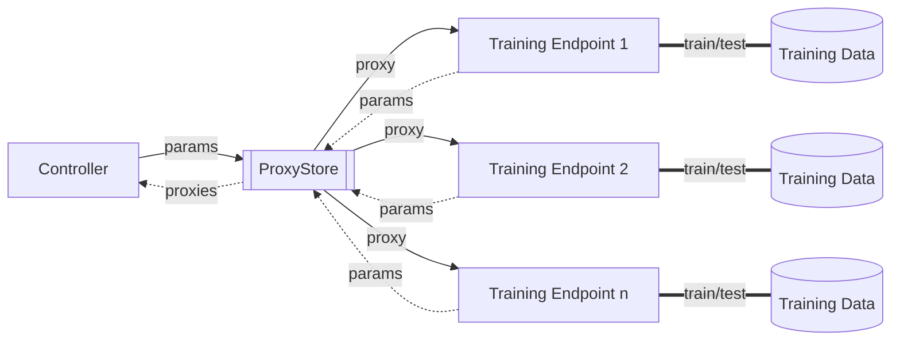

# ProxyFloxy: A simple use case of Federated Learning on top of data decoupling with ProxyStore

This repo is a simple app that modifies the `FLoX-v0.1.0` code base to incorporate ProxyStore as a data transfer
protocol.

Below is a high-level visual of how this approach works. In traditional FL, where the aggregator/controller and the
training endpoints directly share raw model parameters with one another. This application instead inserts ProxyStore as
a data decoupling abstraction. This handles the finer details regarding data transfer and ensures that model parameters
have arrived when they are needed for aggregation.

***

### TODO:

- [ ] Look into the using
  the [EndpointConnector](https://docs.proxystore.dev/main/guides/endpoints/#endpointconnector) for orchestrating
  proxy transfer across all endpoints. Greg suggests to use the `EndpointConnector`.
- [ ] Polish the current code to be more somewhat legible.
- [ ] Implement a more complex model (loosely based on MobileNet but for CIFAR-10). We want a more complex model to
  make the data transfer improvements maybe a bit more interesting.

### NOTES:

- Batch size on the raspberry pis (they're v3) needs to be very small (i.e., `1`).