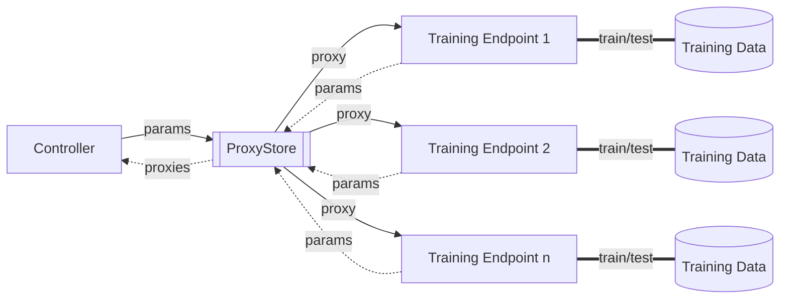

# ProxyFloxy: A simple use case of Federated Learning on top of data decoupling with ProxyStore

[](https://zenodo.org/badge/latestdoi/624906583)

This repo is a simple app that modifies the `FLoX-v0.1.0` code base to incorporate ProxyStore as a data transfer
protocol.

Below is a high-level visual of how this approach works. In traditional FL, where the aggregator/controller and the
training endpoints directly share raw model parameters with one another. This application instead inserts ProxyStore as
a data decoupling abstraction. This handles the finer details regarding data transfer and ensures that model parameters
have arrived when they are needed for aggregation.



***

## Install

Install the dependencies on the controller/client (e.g., your personal workstation).
```bash
python -m venv venv
. venv/bin/activate
pip install -r requirements.txt
```

### Configure the test bed devices.

Repeat the following for each of the training "edge" devices.
* Install the Python packages as done above on the controller.
* Start a FuncX endpoint and record the UUID.
  ```bash
  $ funcx-endpoint configure fl
  $ funcx-endpoint start fl
  ```
* Start a ProxyStore endpoint and record the UUID.
  ```bash
  $ proxystore-endpoint configure fl --relay-server <relay-server-address>
  $ proxystore-endpoint start fl
  ```

On the controller, create a config file with all of the FuncX and ProxyStore endpoint UUIDs.
See `configs/workstation-endpoints.yml` for an example.
Note that the "controller" endpoint will not have a FuncX endpoint and the "controller" is the local device (e.g., your laptop) running the `main.py` script.

## Run

1. Run the training locally without ProxyStore.
   ```bash
   $ python main.py --endpoints configs/workstation-endpoints.yml --no-proxystore --data-name mnist
   ```
2. Run with ProxyStore.
   ```bash
   $ python main.py --endpoints configs/workstation-endpoints.yml --data-name mnist
   ```

The script will iterate over many different configurations including with and without ProxyStore, different models sizes, and number of trials.
These parameters can be edited in `main.py`.
The workflow will output a file `out/data/results_{timestamp}.csv` with metrics collected from the runs.
